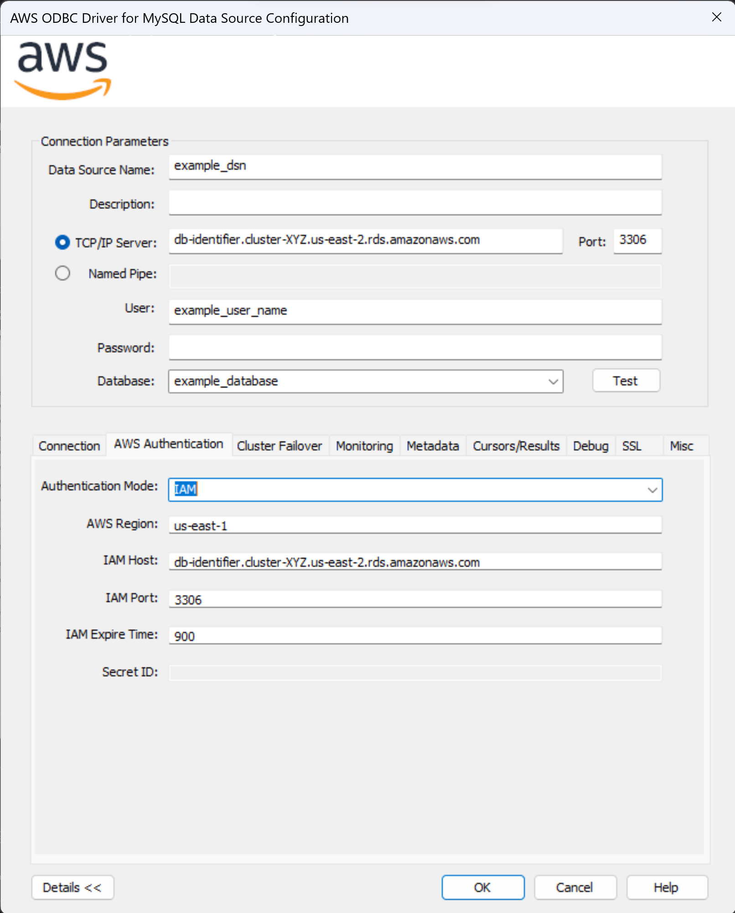
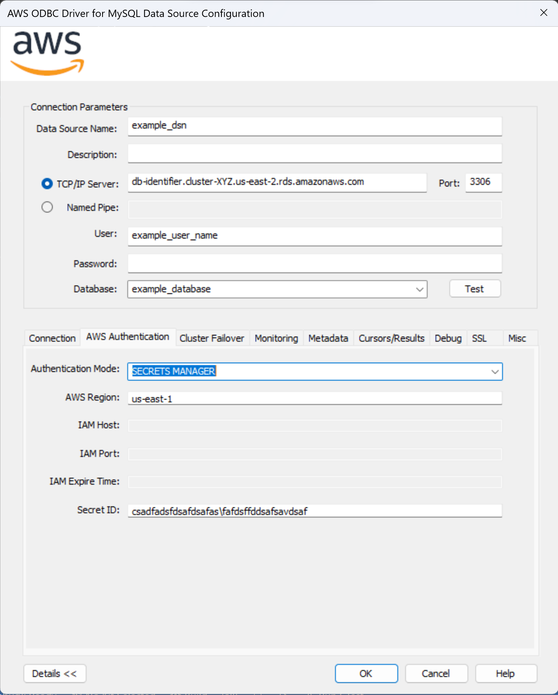

## AWS Authentication

### IAM Authentication

AWS Identity and Access Management (IAM) grants users access control across all Amazon Web Services. IAM supports granular permissions, giving you the ability to grant different permissions to different users. For more information on IAM and it's use cases, please refer to the [IAM documentation](https://docs.aws.amazon.com/IAM/latest/UserGuide/introduction.html).

The AWS ODBC Driver for MySQL supports Amazon AWS Identity and Access Management (IAM) authentication. When using AWS IAM database authentication, the host URL must be a valid Amazon endpoint, and not a custom domain or an IP address.
 ie. `db-identifier.cluster-XYZ.us-east-2.rds.amazonaws.com`

IAM database authentication use is limited to certain database engines. For more information on limitations and recommendations, please [review the IAM documentation](https://docs.aws.amazon.com/AmazonRDS/latest/UserGuide/UsingWithRDS.IAMDBAuth.html).

#### How to use IAM?
1. Enable AWS IAM database authentication on an existing database or create a new database with AWS IAM database authentication on the AWS RDS Console:
    1. If needed, review the documentation about [creating a new database](https://docs.aws.amazon.com/AmazonRDS/latest/UserGuide/USER_CreateDBInstance.html).
    2. If needed, review the documentation about [modifying an existing database](https://docs.aws.amazon.com/AmazonRDS/latest/UserGuide/Overview.DBInstance.Modifying.html).
2. Set up an [AWS IAM policy](https://docs.aws.amazon.com/AmazonRDS/latest/UserGuide/UsingWithRDS.IAMDBAuth.IAMPolicy.html) for AWS IAM database authentication.
3. [Create a database account](https://docs.aws.amazon.com/AmazonRDS/latest/UserGuide/UsingWithRDS.IAMDBAuth.DBAccounts.html) using AWS IAM database authentication:
   Use the following commands to create a new IAM user: 
   `CREATE USER example_user_name IDENTIFIED WITH AWSAuthenticationPlugin AS 'RDS';`
   `GRANT ALL PRIVILEGES ON example_database.* TO 'example_user_name'@'%';`
4. Connect to a MySQL database with the following connection parameters configured in a DSN or connection string. (Note these are in addition to the parameters that you can configure for the [MySQL Connector/ODBC driver](https://dev.mysql.com/doc/connector-odbc/en/connector-odbc-configuration-connection-parameters.html))

| Option                | Description                                                                                                                                      | Type  | Required | Default     |
|-----------------------|--------------------------------------------------------------------------------------------------------------------------------------------------|-------|----------|-------------|
| `AUTHENTICATION_MODE` | Set to `IAM` to enable IAM Authentication.                                                                                                       | char* | Yes      | Off         |
| `AWS_REGION`          | Region used to generate IAM tokens.                                                                                                              | char* | No       | `us-east-1` |
| `IAM_HOST`            | Host URL for IAM authentication. URL must be a valid Amazon endpoint, and not a custom domain or an IP address.                                  | char* | Yes      | Empty       |
| `IAM_PORT`            | Port used for IAM authentication.                                                                                                                | int   | No       | `3306`      |
| `IAM_EXPIRATION_TIME` | Amount of time in seconds before the generated IAM token expires. After expiration, future connections will require a new token to be generated. | int   | No       | `900`       |

If you are working with the Windows DSN UI, click `Details >>` and navigate to the `AWS Authentication` tab to configure the parameters.

### Secrets Manager Authentication

The AWS ODBC Driver for MySQL supports usage of database credentials stored as secrets in the [AWS Secrets Manager](https://aws.amazon.com/secrets-manager/). When you connect using Secrets Manager authentication, the driver will retrieve the secret and the connection will be created with the credentials inside that secret.

#### How to use Secrets Manager
The following parameters are required for the AWS Secrets Manager Connection Plugin to retrieve database credentials from the AWS Secrets Manager.

| Option                | Description                                                        | Type  | Required                       | Default     |
|-----------------------|--------------------------------------------------------------------|-------|--------------------------------|-------------|
| `AUTHENTICATION_MODE` | Set to `SECRETS MANAGER` to enable Secrets Manager Authentication. | char* | Yes                            | Off         |
| `AWS_REGION`          | Region of the secret.                                              | char* | Optional when secret id is ARN | `us-east-1` |
| `SECRET_ID`           | Secret name or secret ARN.                                         | char* | Yes                            | Empty       |

If you are working with the Windows DSN UI, click `Details >>` and navigate to the `AWS Authentication` tab to configure the parameters.

