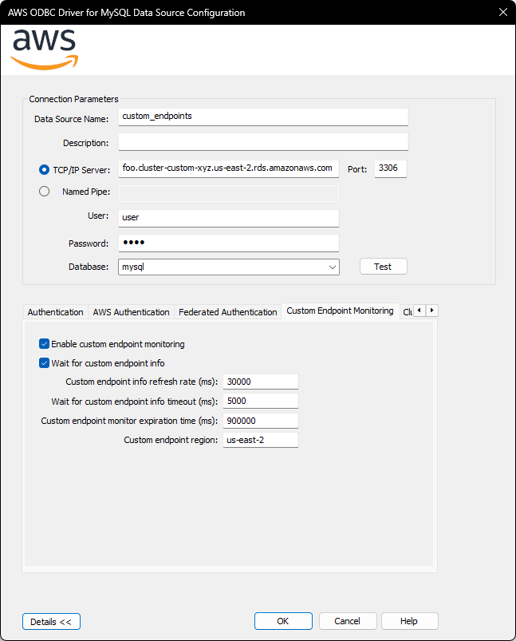

# Custom Endpoint Support

The Custom Endpoint support allows client application to use the driver with [RDS custom endpoints](https://docs.aws.amazon.com/AmazonRDS/latest/AuroraUserGuide/Aurora.Endpoints.Custom.html). When the Custom Endpoint feature is enabled, the driver will analyse custom endpoint information to ensure instances used in connections are part of the custom endpoint being used. This includes connections used in failover.

## How to use the Driver with Custom Endpoint

### Enabling the Custom Endpoint Feature

1. If needed, create a custom endpoint using the AWS RDS Console:
   - If needed, review the documentation about [creating a custom endpoint](https://docs.aws.amazon.com/AmazonRDS/latest/AuroraUserGuide/aurora-custom-endpoint-creating.html).
2. Set `ENABLE_CUSTOM_ENDPOINT_MONITORING` to `TRUE` to enable custom endpoint support.
3. If you are using the failover plugin, set the failover parameter `FAILOVER_MODE` according to the custom endpoint type. For example, if the custom endpoint you are using is of type `READER`, you can set `FAILOVER_MODE` to `strict reader`, or if it is of type `ANY`, you can set `FAILOVER_MODE` to `reader or writer`.
4. Specify parameters that are required or specific to your case.

### Custom Endpoint Plugin Parameters

| Parameter                                  | Value  | Required | Description                                                                                                                                                                                                                                                                                                                          | Default Value         | Example Value |
| ------------------------------------------ | :----: | :------: | :--------------------------------------------------------------------------------------------------------------------------------------------------------------------------------------------------------------------------------------c--------------------------------------------------------------------------------------------- | --------------------- | ------------- |
| `ENABLE_CUSTOM_ENDPOINT_MONITORING`        |  bool  |    No    | Set to TRUE to enable custom endpoint support.                                                                                                                                                                                                                                                                                       | `FALSE`               | `TRUE`        |
| `CUSTOM_ENDPOINT_REGION`                   | string |    No    | The region of the cluster's custom endpoints. If not specified, the region will be parsed from the URL.                                                                                                                                                                                                                              | `N/A`                 | `us-west-1`   |
| `CUSTOM_ENDPOINT_INFO_REFRESH_RATE_MS`     |  long  |    No    | Controls how frequently custom endpoint monitors fetch custom endpoint info, in milliseconds.                                                                                                                                                                                                                                        | `30000`               | `20000`       |
| `CUSTOM_ENDPOINT_MONITOR_EXPIRATION_MS`    |  long  |    No    | Controls how long a monitor should run without use before expiring and being removed, in milliseconds.                                                                                                                                                                                                                               | `900000` (15 minutes) | `600000`      |
| `WAIT_FOR_CUSTOM_ENDPOINT_INFO`            |  bool  |    No    | Controls whether to wait for custom endpoint info to become available before connecting or executing a method. Waiting is only necessary if a connection to a given custom endpoint has not been opened or used recently. Note that disabling this may result in occasional connections to instances outside of the custom endpoint. | `TRUE`                | `TRUE`        |
| `WAIT_FOR_CUSTOM_ENDPOINT_INFO_TIMEOUT_MS` |  long  |    No    | Controls the maximum amount of time that the plugin will wait for custom endpoint info to be made available by the custom endpoint monitor, in milliseconds.                                                                                                                                                                         | `5000`                | `7000`        |

