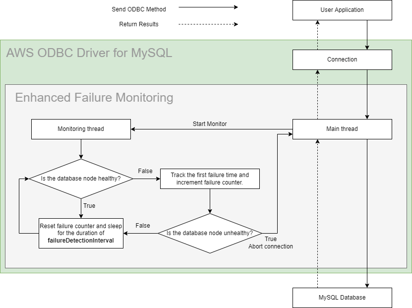

# Host Monitoring

## Enhanced Failure Monitoring

The figure above shows a simplified workflow of Enhanced Failure Monitoring (EFM). Enhanced Failure Monitoring is a feature that is available within the AWS ODBC Driver for MySQL. There is a monitor that will periodically check the connected database node's health, or availability. If a database node is determined to be unhealthy, the connection will be aborted. This check uses the [Enhanced Failure Monitoring Parameters](#enhanced-failure-monitoring-parameters) and a database node's responsiveness to determine whether a node is healthy.

### The Benefits Enhanced Failure Monitoring
Enhanced Failure Monitoring helps user applications detect failures earlier. When a user application executes a query, EFM may detect that the connected database node is unavailable. When this happens, the query is cancelled and the connection will be aborted. This allows queries to fail fast instead of waiting indefinitely or failing due to a timeout.

One use case is to pair EFM with [Failover](./using-the-aws-driver/UsingTheAwsDriver.md#failover-specific-options). When EFM discovers a database node failure, the connection will be aborted. Without Failover enabled, the connection would be terminated up to the user application level. If Failover is enabled, the AWS ODBC Driver for MySQL can attempt to failover to a different, healthy database node where the query can be executed.

Not all user applications will have a need for Enhanced Failure Monitoring. If a user application's query times are predictable and short, and the application does not execute any long-running SQL queries, Enhanced Failure Monitoring may be replaced with a simple network timeout that would consume fewer resources and would be simpler to configure. 

Although this is a viable alternative, EFM is more configurable than simple network timeouts. Users should keep these advantages and disadvantages in mind when deciding whether Enhanced Failure Monitoring is suitable for their application.

#### Simple Network Timeout
This option is useful when a user application executes quick statements that run for predictable lengths of time. In this case, the network timeout should be set to a value such as the 95th to 99th percentile. One can set network timeout by setting the `NETWORK_TIMEOUT` property in the `odbc.ini` file, or appending `NETWORK_TIMEOUT=?;` to the connection string (where `?` indicates the timeout value in seconds) or in the UI to configure the DSN.

### Enabling Host Monitoring
Enhanced Failure Monitoring is enabled by default in AWS ODBC Driver for MySQL, but it can be disabled with the parameter `ENABLE_FAILURE_DETECTION` is set to `0` in `odbc.ini` or in the connection string.
> 
### Enhanced Failure Monitoring Parameters

The parameters `FAILURE_DETECTION_TIME`, `FAILURE_DETECTION_INTERVAL`, and `FAILURE_DETECTION_COUNT` are similar to TCP Keepalive parameters. Each connection has its own set of parameters. The `FAILURE_DETECTION_TIME` is how long the monitor waits after a SQL query is started to send a probe to a database node. The `FAILURE_DETECTION_INTERVAL` is how often the monitor sends a probe to a database node. The `FAILURE_DETECTION_COUNT` is how many times a monitor probe can go unacknowledged before the database node is deemed unhealthy. 

To determine the health of a database node: 
1. The monitor will first wait for a time equivalent to the `FAILURE_DETECTION_TIME`. 
2. Then, every `FAILURE_DETECTION_INTERVAL`, the monitor will send a probe to the database node. 
3. If the probe is not acknowledged by the database node, a counter is incremented. 
4. If the counter reaches the `FAILURE_DETECTION_COUNT`, the database node will be deemed unhealthy and the connection will be aborted.

If a more aggressive approach to failure checking is necessary, all of these parameters can be reduced to reflect that. However, increased failure checking may also lead to an increase in false positives. For example, if the `FAILURE_DETECTION_INTERVAL` was shortened, the plugin may complete several connection checks that all fail. The database node would then be considered unhealthy, but it may have been about to recover and the connection checks were completed before that could happen.

To configure failure detection, you can specify the following parameters in a DSN or connection string. If the values for these options are not specified, the default values will be used. If you are dealing with the Windows DSN UI, click `Details >>` and navigate to the `Monitoring` tab to find the equivalent parameters.

| Option                             | Description                                                                                                                                                                                                                                                                                                                                                                        | Type   | Required | Default                                  |
| ---------------------------------- |------------------------------------------------------------------------------------------------------------------------------------------------------------------------------------------------------------------------------------------------------------------------------------------------------------------------------------------------------------------------------------|--------|----------|------------------------------------------|
| `ENABLE_FAILURE_DETECTION`         | Set to `1` to enable the fast failover behaviour offered by the AWS ODBC Driver for MySQL.                                                                                                                                                                                                                                                                                         | bool   | No       | `1`                                      |
| `FAILURE_DETECTION_TIME`           | Interval in milliseconds between sending a SQL query to the server and the first probe to the database node.                                                                                                                                                                                                                                                                       | int    | No       | `30000`                                  |
| `FAILURE_DETECTION_INTERVAL`       | Interval in milliseconds between probes to database node.                                                                                                                                                                                                                                                                                                                          | int    | No       | `5000`                                   |
| `FAILURE_DETECTION_COUNT`          | Number of failed connection checks before considering database node as unhealthy.                                                                                                                                                                                                                                                                                                  | int    | No       | `3`                                      |
| `MONITOR_DISPOSAL_TIME`            | Interval in milliseconds for a monitor to be considered inactive and to be disposed.                                                                                                                                                                                                                                                                                               | int    | No       | `60000`                                  |

> :heavy_exclamation_mark: **Always ensure you provide a non-zero network timeout value or a connect timeout value in your DSN**
>
> AWS ODBC Driver for MySQL has a default non-zero value for `NETWORK_TIMEOUT` and `CONNECT_TIMEOUT`. If one decides to alter those values and set those values to 0, EFM may wait forever to establish a monitoring connection in the event where the database node is unavailable. As a general rule, **do not** override those values to 0.

>### :warning: Warnings About Usage of the AWS ODBC Driver for MySQL with RDS Proxy
> It is recommended to either disable Host Monitoring, or to avoid using RDS Proxy endpoints when the Host Monitoring is enabled.
>
> Although using RDS Proxy endpoints with the Enhanced Failure Monitoring doesn't cause any critical issues, this approach is not recommended. The main reason is that RDS Proxy transparently re-routes requests to one database instance. RDS Proxy decides which database instance is used based on many criteria, and it's on a per-request basis. Such switching between different instances makes Host Monitoring useless in terms of instance health monitoring. It will not be able to identify what actual instance it is connected to and which one it's monitoring. That could be a source of false positive failure detections. At the same time, it could still proactively monitor network connectivity to RDS Proxy endpoints and report outages back to a user application if they occur.
