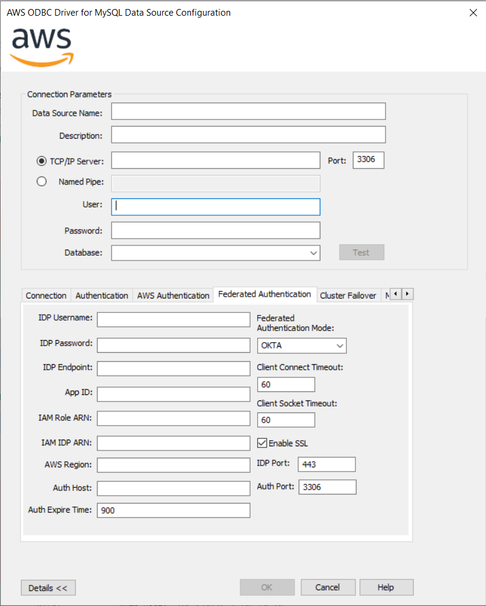

# Okta Authentication Support

Okta Authentication support allows authentication via Federated Identity and then database access via IAM.

## What is Federated Identity

Federated Identity allows users to use the same set of credentials to access multiple services or resources across different organizations. This works by having Identity Providers (IdP) that manage and authenticate user credentials, and Service Providers (SP) that are services or resources that can be internal, external, and/or belonging to various organizations. Multiple SPs can establish trust relationships with a single IdP.

When a user wants access to a resource, it authenticates with the IdP. From this an authentication token is generated and is passed to the SP then grants access to said resource. To learn more about Okta, see Okta's documentation [here](https://help.okta.com/en-us/content/topics/apps/apps-about-saml.htm).

## How to use Okta Authentication?

> [!NOTE]\
> AWS IAM database authentication is needed to use Okta Authentication. This is because after the plugin acquires SAML assertion from the identity provider, the SAML Assertion is then used to acquire an AWS authentication token. The AWS authentication token is then subsequently used to access the database.

1. Enable AWS IAM database authentication on an existing database or create a new database with AWS IAM database authentication on the AWS RDS Console:
    1. If needed, review the documentation about [modifying an existing database](https://docs.aws.amazon.com/AmazonRDS/latest/UserGuide/Overview.DBInstance.Modifying.html).
    2. If needed, review the documentation about [creating a new database](https://docs.aws.amazon.com/AmazonRDS/latest/UserGuide/USER_CreateDBInstance.html).
2. Set up an [AWS IAM policy](https://docs.aws.amazon.com/AmazonRDS/latest/UserGuide/UsingWithRDS.IAMDBAuth.IAMPolicy.html) for AWS IAM database authentication.
3. [Create a database account](https://docs.aws.amazon.com/AmazonRDS/latest/UserGuide/UsingWithRDS.IAMDBAuth.DBAccounts.html) using AWS IAM database authentication:
   Use the following commands to create a new IAM user:<br>
   ```mysql
   CREATE USER example_user_name IDENTIFIED WITH AWSAuthenticationPlugin AS 'RDS';
   GRANT ALL PRIVILEGES ON example_database.* TO 'example_user_name'@'%';
   ```
4. Connect to a MySQL database with the following connection parameters configured in a DSN or connection string. (Note these are in addition to the parameters that you can configure for the [MySQL Connector/ODBC driver](https://dev.mysql.com/doc/connector-odbc/en/connector-odbc-configuration-connection-parameters.html))

| Parameter                | Required | Description                                                                                                                                                                                                    | Default Value | Example Value                                          |
|--------------------------|:--------:|:---------------------------------------------------------------------------------------------------------------------------------------------------------------------------------------------------------------|---------------|--------------------------------------------------------|
| `FED_AUTH_MODE`          |   Yes    | The federated authentication mode. Set it to OKTA to enable Okta authentication.                                                                                                                               | `null`        | `OKTA`                                                 |
| `IDP_USERNAME`           |   Yes    | The user name to log into Okta.                                                                                                                                                                                | `null`        | `jimbob@example.com`                                   |
| `IDP_PASSWORD`           |   Yes    | The password associated with the `IDP_ENDPOINT` username. This is used to log into the Okta.                                                                                                                   | `null`        | `someRandomPassword`                                   |
| `IDP_ENDPOINT`           |   Yes    | The hosting URL for the Okta service that you are using to authenticate into AWS Aurora.                                                                                                                       | `null`        | `ec2amaz-ab3cdef.example.com`                          |
| `APP_ID`                 |   Yes    | The Amazon Web Services (AWS) app [configured](https://help.okta.com/en-us/content/topics/deploymentguides/aws/aws-configure-aws-app.htm) on Okta.                                                             | `null`        | `ec2amaz-ab3cdef.example.com`                          |
| `IAM_ROLE_ARN`           |   Yes    | The ARN of the IAM Role that is to be assumed to access AWS Aurora.                                                                                                                                            | `null`        | `arn:aws:iam::123456789012:role/adfs_example_iam_role` |
| `IAM_IDP_ARN`            |   Yes    | The ARN of the Identity Provider.                                                                                                                                                                              | `null`        | `arn:aws:iam::123456789012:saml-provider/adfs_example` |
| `FED_AWS_REGION`         |   Yes    | The AWS region where the identity provider is located.                                                                                                                                                         | `null`        | `us-east-2`                                            |
| `USERNAME`               |   Yes    | The Username must be set to the [IAM database user](https://docs.aws.amazon.com/AmazonRDS/latest/UserGuide/UsingWithRDS.IAMDBAuth.html).                                                                       | `null`        | `jane_doe`                                             |
| `IDP_PORT`               |    No    | The port that the host for the authentication service listens at.                                                                                                                                              | `443`         | `443`                                                  |
| `FED_AUTH_HOST`          |    No    | Overrides the host used to generate the authentication token. This is useful when you are connecting using a custom endpoint, since authentication tokens need to be generated using the RDS/Aurora endpoints. | `null`        | `database.cluster-hash.region.rds.amazonaws.com`       |
| `FED_AUTH_DEFAULT_PORT`  |    No    | This property overrides the default port that is used to generate the authentication token. The default port is the default MySQL port.                                                                        | `3306`        | `1234`                                                 |
| `FED_AUTH_EXPIRATION_TIME`|    No    | Overrides the default IAM token cache expiration in seconds.                                                                                                                                                   | `900`         | `123`                                                  |
| `CLIENT_SOCKET_TIMEOUT`  |    No    | The read and write timeout value in seconds for the HttpClient used during the Okta authentication workflow.                                                                                                   | `60`          | `30`                                                   |
| `CLIENT_CONNECT_TIMEOUT` |    No    | The connect timeout value in seconds for the HttpClient used during the Okta authentication workflow.                                                                                                          | `60`          | `30`                                                   |
| `ENABLE_SSL`             |    No    | Set to false to disable server certificate verification. Useful during local development when testing locally hosted servers using self-signed certificates. Not recommended for production.                   | `true`        | `false`                                                |

If you are working with the Windows DSN UI, click `Details >>` and navigate to the `Federated Authentication` tab to configure the parameters.


