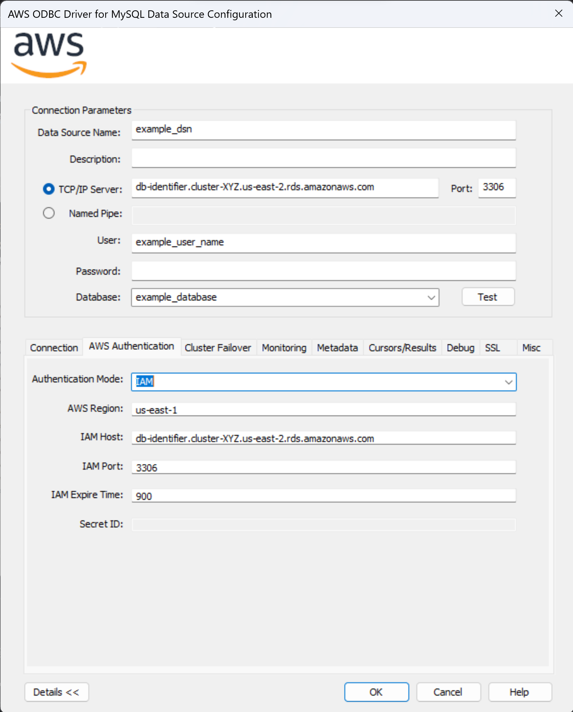
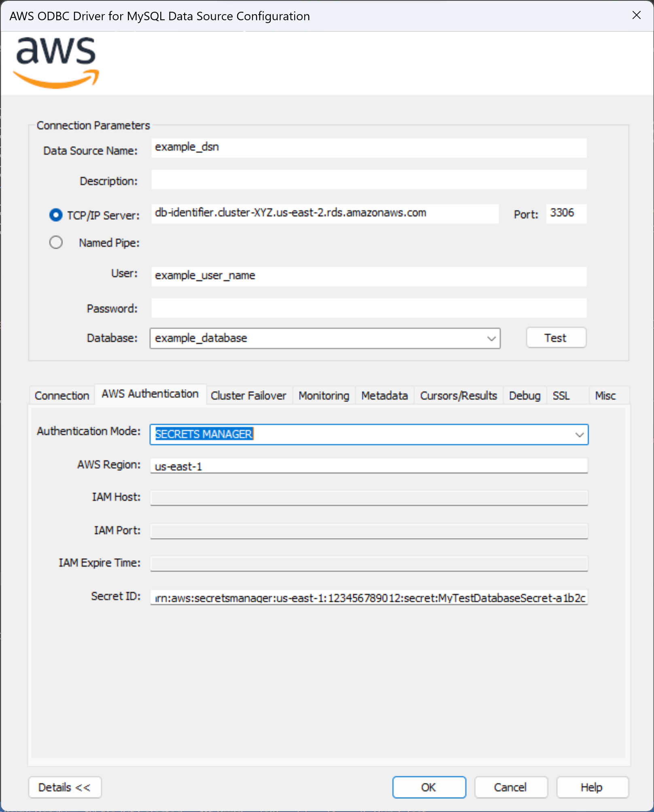

# Using the AWS ODBC Driver for MySQL

The AWS ODBC Driver for MySQL is drop-in compatible, so its usage is identical to the [MySQL Connector/ODBC driver](https://github.com/mysql/mysql-connector-odbc/). The sections below highlight driver usage specific to failover.

## Failover Process

In an Amazon Aurora database (DB) cluster, failover is a mechanism by which Aurora automatically repairs the DB cluster status when a primary DB instance becomes unavailable. It achieves this goal by electing an Aurora Replica to become the new primary DB instance, so that the DB cluster can provide maximum availability to a primary read-write DB instance. The AWS ODBC Driver for MySQL uses the Failover Plugin to coordinate with this behavior in order to provide minimal downtime in the event of a DB instance failure.


The figure above provides a simplified overview of how the AWS ODBC Driver for MySQL handles an Aurora failover encounter. Starting at the top of the diagram, an application using the driver sends a request to get a logical connection to an Aurora database.

In this example, the application requests a connection using the Aurora DB cluster endpoint and is returned a logical connection that is physically connected to the primary DB instance in the DB cluster, DB instance C. By design, details about which specific DB instance the physical connection is connected to have been abstracted away.

Over the course of the application's lifetime, it executes various statements against the logical connection. If DB instance C is stable and active, these statements succeed and the application continues as normal. If DB instance C experiences a failure, Aurora will initiate failover to promote a new primary DB instance. At the same time, the AWS ODBC Driver for MySQL will intercept the related communication exception and kick off its own internal failover process.

If the primary DB instance has failed, the driver will use its internal topology cache to temporarily connect to an active Aurora Replica. This Aurora Replica will be periodically queried for the DB cluster topology until the new primary DB instance is identified (DB instance A or B in this case).

At this point, the driver will connect to the new primary DB instance and return control to the application to allow the user to reconfigure the session state as needed. Although the DNS endpoint for the DB cluster might not yet resolve to the new primary DB instance, the driver has already discovered this new DB instance during its failover process, and will be directly connected to it when the application continues executing statements. In this way the driver provides a faster way to reconnect to a newly promoted DB instance, thus increasing the availability of the DB cluster.

## Connection Strings and Configuring the Driver

To set up a connection, the driver uses an ODBC connection string. An ODBC connection string specifies a set of semicolon-delimited connection options. Typically, a connection string will either:

1. specify a Data Source Name containing a preconfigured set of options (`DSN=xxx;`) or
2. configure options explicitly (`SERVER=xxx;PORT=xxx;...;`). This option will override values set inside the DSN.

## Failover Specific Options

In addition to the parameters that you can configure for the [MySQL Connector/ODBC driver](https://dev.mysql.com/doc/connector-odbc/en/connector-odbc-configuration-connection-parameters.html), you can configure the following parameters in a DSN or connection string to specify failover behaviour. If the values for these options are not specified, the default values will be used. If you are dealing with the Windows DSN UI, click `Details >>` and navigate to the `Cluster Failover` tab to find the equivalent parameters.

| Option                             | Description                                                                                                                                                                                                                                                                                                                                                                        | Type   | Required | Default                                  |
| ---------------------------------- |------------------------------------------------------------------------------------------------------------------------------------------------------------------------------------------------------------------------------------------------------------------------------------------------------------------------------------------------------------------------------------|--------|----------|------------------------------------------|
| `ENABLE_CLUSTER_FAILOVER`            | Set to `1` to enable the fast failover behaviour offered by the AWS ODBC Driver for MySQL.                                                                                                                                                                                                                                                                                         | bool   | No       | `1`                                      |
| `FAILOVER_MODE`           | Defines a mode for failover process. Failover process may prioritize nodes with different roles and connect to them. Possible values: <br><br>- `strict writer` - Failover process follows writer node and connects to a new writer when it changes.<br>- `reader or writer` - During failover, the driver tries to connect to any available/accessible reader node. If no reader is available, the driver will connect to a writer node. This logic mimics the logic of the Aurora read-only cluster endpoint.<br>- `strict reader` - During failover, the driver tries to connect to any available reader node. If no reader is available, the driver raises an error. Reader failover to a writer node will only be allowed for single-node clusters. This logic mimics the logic of the Aurora read-only cluster endpoint.                                                                                                                                                                                                                                                                                                  | char*   | No       | Default value depends on connection url. For Aurora read-only cluster endpoint, it's set to `reader or writer`. Otherwise, it's `strict writer`.                                      |                                      |
| `GATHER_PERF_METRICS`                | Set to `1` to record failover-associated metrics.                                                                                                                                                                                                                                                                                                                                  | bool   | No       | `0`                                      |
| `GATHER_PERF_METRICS_PER_INSTANCE`   | Set to `1` to gather additional performance metrics per instance as well as cluster.                                                                                                                                                                                                                                                                                               | bool   | No       | `0`                                      |
| `HOST_PATTERN`                       | This parameter is not required unless connecting to an AWS RDS cluster via an IP address or custom domain URL. In those cases, this parameter specifies the cluster instance DNS pattern that will be used to build a complete instance endpoint. A "?" character in this pattern should be used as a placeholder for the DB instance identifiers of the instances in the cluster.  <br/><br/>Example: `?.my-domain.com`, `any-subdomain.?.my-domain.com:9999`<br/><br/>Usecase Example: If your cluster instance endpoint follows this pattern:`instanceIdentifier1.customHost`, `instanceIdentifier2.customHost`, etc. and you want your initial connection to be to `customHost:1234`, then your connection string should look like this: `SERVER=customHost;PORT=1234;DATABASE=test;HOST_PATTERN=?.customHost` <br><br/> If the provided connection string is not an IP address or custom domain, the driver will automatically acquire the cluster instance host pattern from the customer-provided connection string. | char\* | If connecting using an IP address or custom domain URL: Yes <br><br> Otherwise: No <br><br> See [Host Pattern](#host-pattern) for more details. | `NONE`                                   |
| `CLUSTER_ID`                         | A unique identifier for the cluster. Connections with the same cluster ID share a cluster topology cache. This connection parameter is not required and thus should only be set if desired.                                                                                                                                                                                        | char\* | No       | Either the cluster ID or the instance ID, depending on whether the provided connection string is a cluster or instance URL. |
| `TOPOLOGY_REFRESH_RATE`              | Cluster topology refresh rate in milliseconds. The cached topology for the cluster will be invalidated after the specified time, after which it will be updated during the next interaction with the connection.                                                                                                                                                                   | int    | No       | `30000`                                  |
| `FAILOVER_TIMEOUT`                   | Maximum allowed time in milliseconds to attempt reconnecting to a new writer or reader instance after a cluster failover is initiated.                                                                                                                                                                                                                                             | int    | No       | `60000`                                  |
| `FAILOVER_TOPOLOGY_REFRESH_RATE`     | Cluster topology refresh rate in milliseconds during a writer failover process. During the writer failover process, cluster topology may be refreshed at a faster pace than normal to speed up discovery of the newly promoted writer.                                                                                                                                             | int    | No       | `5000`                                   |
| `FAILOVER_WRITER_RECONNECT_INTERVAL` | Interval of time in milliseconds to wait between attempts to reconnect to a failed writer during a writer failover process.                                                                                                                                                                                                                                                        | int    | No       | `5000`                                   |
| `FAILOVER_READER_CONNECT_TIMEOUT`    | Maximum allowed time in milliseconds to attempt a connection to a reader instance during a reader failover process.                                                                                                                                                                                                                                                                | int    | No       | `30000`                                  |
| `CONNECT_TIMEOUT`                    | Timeout (in seconds) for socket connect, with 0 being no timeout.                                                                                                                                                                                                                                                                                                                  | int    | No       | `30`                                     |
| `NETWORK_TIMEOUT`                    | Timeout (in seconds) on network socket operations, with 0 being no timeout.                                                                                                                                                                                                                                                                                                        | int    | No       | `30`                                     |

### Driver Behaviour During Failover For Different Connection URLs


### Host Pattern

When connecting to Aurora clusters, this parameter is required when the connection string does not provide enough information about the database cluster domain name. If the Aurora cluster endpoint is used directly, the driver will recognize the standard Aurora domain name and can re-build a proper Aurora instance name when needed. In cases where the connection string uses an IP address, a custom domain name or localhost, the driver won't know how to build a proper domain name for a database instance endpoint. For example, if a custom domain was being used and the cluster instance endpoints followed a pattern of `instanceIdentifier1.customHost`, `instanceIdentifier2.customHost`, etc, the driver would need to know how to construct the instance endpoints using the specified custom domain. Because there isn't enough information from the custom domain alone to create the instance endpoints, the `HOST_PATTERN` should be set to `?.customHost`, making the connection string `SERVER=customHost;PORT=1234;DATABASE=test;HOST_PATTERN=?.customHost`. Refer to [Driver Behaviour During Failover For Different Connection URLs](#driver-behaviour-during-failover-for-different-connection-urls) for more examples.

## Failover Exception Codes

### 08S01 - Communication Link Failure

When the driver returns an error code ```08S01```, the original connection failed, and the driver tried to failover to a new instance, but was not able to. There are various reasons this may happen: no nodes were available, a network failure occurred, and so on. In this scenario, please wait until the server is up or other problems are solved.

### 08S02 - Communication Link Changed

When the driver returns an error code ```08S02```, the original connection failed while autocommit was set to true, and the driver successfully failed over to another available instance in the cluster. However, any session state configuration of the initial connection is now lost. In this scenario, you should:

1. Reconfigure and reuse the original connection (the reconfigured session state will be the same as the original connection).
2. Repeat the query that was executed when the connection failed and continue work as desired.

#### Sample Code

```cpp
#include <iostream>
#include <sql.h>
#include <sqlext.h>

#define MAX_NAME_LEN 255
#define SQL_MAX_MESSAGE_LENGTH 512

// Scenario 1: Failover happens when autocommit is set to true - SQLRETURN with code 08S02.

void setInitialSessionState(SQLHDBC dbc, SQLHSTMT handle) {
    const auto set_timezone = (SQLCHAR*)"SET time_zone = \"+00:00\"";
    SQLExecDirect(handle, set_timezone, SQL_NTS);
}

bool executeQuery(SQLHDBC dbc, SQLCHAR* query) {
    int MAX_RETRIES = 5;
    SQLHSTMT handle;
    SQLCHAR sqlstate[6], message[SQL_MAX_MESSAGE_LENGTH];
    SQLRETURN ret;

    SQLAllocHandle(SQL_HANDLE_STMT, dbc, &handle);

    int retries = 0;
    bool success = false;

    while (true) {
        ret = SQLExecDirect(handle, query, SQL_NTS);

        if (SQL_SUCCEEDED(ret)) {
            success = true;
            break;
        }
        else {
            if (retries > MAX_RETRIES) {
                break;
            }

            // Check what kind of error has occurred
            SQLSMALLINT stmt_length;
            SQLINTEGER native_error;
            SQLError(nullptr, nullptr, handle, sqlstate, &native_error, message, SQL_MAX_MESSAGE_LENGTH - 1, &stmt_length);
            const std::string state = (char*)sqlstate;

            // Failover has occurred and the driver has failed over to another instance successfully
            if (state.compare("08S02") == 0) {
                // Reconfigure the connection
                setInitialSessionState(dbc, handle);
                // Re-execute that query again
                retries++;
            }
            else {
                // If other exceptions occur
                break;
            }
        }
    }

    SQLFreeHandle(SQL_HANDLE_STMT, handle);
    return success;
}

int main() {
    SQLHENV env;
    SQLHDBC dbc;
    SQLSMALLINT len;
    SQLRETURN ret;
    SQLCHAR conn_in[4096], conn_out[4096];

    SQLAllocHandle(SQL_HANDLE_ENV, nullptr, &env);
    SQLSetEnvAttr(env, SQL_ATTR_ODBC_VERSION, reinterpret_cast<SQLPOINTER>(SQL_OV_ODBC3), 0);
    SQLAllocHandle(SQL_HANDLE_DBC, env, &dbc);

    const char* dsn = "AWSODBCDriverDSN";
    const char* user = "username";
    const char* pwd = "password";
    const char* server = "db-identifier-cluster-XYZ.us-east-2.rds.amazonaws.com";
    int port = 3306;
    const char* db = "employees";

    sprintf(reinterpret_cast<char*>(conn_in), "DSN=%s;UID=%s;PWD=%s;SERVER=%s;PORT=%d;DATABASE=%s;", dsn, user, pwd, server, port, db);
    
    // attempt a connection
    ret = SQLDriverConnect(dbc, nullptr, conn_in, SQL_NTS, conn_out, MAX_NAME_LEN, &len, SQL_DRIVER_NOPROMPT);
    
    if (SQL_SUCCEEDED(ret)) {
        // if the connection is successful, execute a query using the AWS ODBC Driver for MySQL
        const auto sleep_stmt = (SQLCHAR*)"SELECT * from employees*";
        executeQuery(dbc, sleep_stmt);
    }

    SQLDisconnect(dbc);
    SQLFreeHandle(SQL_HANDLE_DBC, dbc);
    SQLFreeHandle(SQL_HANDLE_ENV, env);

    return 0;
}
```

### 08007 - Connection Failure During Transaction

When the driver returns an error code ```08007```, the original connection failed within a transaction (while autocommit was set to false). In this scenario, when the transaction ends, the driver first attempts to rollback the transaction, and then fails over to another available instance in the cluster. Note that the rollback might be unsuccessful as the initial connection may be broken at the time that the driver recognizes the problem. Note also that any session state configuration of the initial connection is now lost. In this scenario, you should:

1. Reconfigure and reuse the original connection (the reconfigured session state will be the same as the original connection).
2. Re-start the transaction and repeat all queries which were executed during the transaction before the connection failed.
3. Repeat the query that was executed when the connection failed, and continue work.

#### Sample Code

```cpp
#include <iostream>
#include <sql.h>
#include <sqlext.h>

#define MAX_NAME_LEN 255
#define SQL_MAX_MESSAGE_LENGTH 512

// Scenario 2: Failover happens when autocommit is set to false - SQLRETURN with code 08007.

void setInitialSessionState(SQLHDBC dbc, SQLHSTMT handle) {
    const auto set_timezone = (SQLCHAR*)"SET time_zone = \"+00:00\"";
    const auto setup_autocommit_query = (SQLCHAR*)"SET autocommit = 0";

    SQLExecDirect(handle, set_timezone, SQL_NTS);
    SQLExecDirect(handle, setup_autocommit_query, SQL_NTS);
}

bool executeQuery(SQLHDBC dbc) {
    int MAX_RETRIES = 5;
    SQLHSTMT handle;
    SQLCHAR sqlstate[6], message[SQL_MAX_MESSAGE_LENGTH];
    SQLRETURN ret;

    // Queries to execute in a transaction
    SQLCHAR* queries[] = {
        (SQLCHAR*)"INSERT INTO employees(emp_no, birth_date, first_name, last_name, gender, hire_date) VALUES (5000000, '1958-05-01', 'John', 'Doe', 'M', '1997-11-30')",
        (SQLCHAR*)"INSERT INTO employees(emp_no, birth_date, first_name, last_name, gender, hire_date) VALUES (5000001, '1958-05-01', 'Mary', 'Malcolm', 'F', '1997-11-30')",
        (SQLCHAR*)"INSERT INTO employees(emp_no, birth_date, first_name, last_name, gender, hire_date) VALUES (5000002, '1958-05-01', 'Tom', 'Jerry', 'M', '1997-11-30')"
    };

    SQLAllocHandle(SQL_HANDLE_STMT, dbc, &handle);
    setInitialSessionState(dbc, handle);

    int retries = 0;
    bool success = false;

    while (true) {
        for (SQLCHAR* query : queries) {
            ret = SQLExecDirect(handle, query, SQL_NTS);
        }
        SQLEndTran(SQL_HANDLE_DBC, dbc, SQL_COMMIT);

        if (SQL_SUCCEEDED(ret)) {
            success = true;
            break;
        } else {
            if (retries > MAX_RETRIES) {
                break;
            }

            // Check what kind of error has occurred
            SQLSMALLINT stmt_length;
            SQLINTEGER native_error;
            SQLError(nullptr, nullptr, handle, sqlstate, &native_error, message, SQL_MAX_MESSAGE_LENGTH - 1, &stmt_length);
            const std::string state = (char*)sqlstate;

            // Failover has occurred and the driver has failed over to another instance successfully
            if (state.compare("08007") == 0) {
                // Reconfigure the connection
                setInitialSessionState(dbc, handle);
                // Re-execute every queriy that was inside the transaction
                retries++;
            }
            else {
                // If other exceptions occur
                break;
            }
        }
    }

    return success;
}

int main() {
    SQLHENV env;
    SQLHDBC dbc;
    SQLSMALLINT len;
    SQLRETURN rc;
    SQLCHAR conn_in[4096], conn_out[4096];

    SQLAllocHandle(SQL_HANDLE_ENV, nullptr, &env);
    SQLSetEnvAttr(env, SQL_ATTR_ODBC_VERSION, reinterpret_cast<SQLPOINTER>(SQL_OV_ODBC3), 0);
    SQLAllocHandle(SQL_HANDLE_DBC, env, &dbc);

    const char* dsn = "AWSODBCDriverDSN";
    const char* user = "username";
    const char* pwd = "password";
    const char* server = "db-identifier-cluster-XYZ.us-east-2.rds.amazonaws.com";
    int port = 3306;
    const char* db = "employees";

    sprintf(reinterpret_cast<char*>(conn_in), "DSN=%s;UID=%s;PWD=%s;SERVER=%s;PORT=%d;DATABASE=%s;", dsn, user, pwd, server, port, db);
    
    // attempt a connection
    rc = SQLDriverConnect(dbc, nullptr, conn_in, SQL_NTS, conn_out, MAX_NAME_LEN, &len, SQL_DRIVER_NOPROMPT);
    
    if (SQL_SUCCEEDED(rc)) {
        // if the connection is successful, execute a query using the AWS ODBC Driver for MySQL
        executeQuery(dbc);
    }

    SQLDisconnect(dbc);
    SQLFreeHandle(SQL_HANDLE_DBC, dbc);
    SQLFreeHandle(SQL_HANDLE_ENV, env);

    return 0;
}
```

## AWS Authentication

### IAM Authentication

AWS Identity and Access Management (IAM) grants users access control across all Amazon Web Services. IAM supports granular permissions, giving you the ability to grant different permissions to different users. For more information on IAM and it's use cases, please refer to the [IAM documentation](https://docs.aws.amazon.com/IAM/latest/UserGuide/introduction.html).

The AWS ODBC Driver for MySQL supports Amazon AWS Identity and Access Management (IAM) authentication. When using AWS IAM database authentication, the host URL must be a valid Amazon endpoint, and not a custom domain or an IP address.
<br>ie. `db-identifier.cluster-XYZ.us-east-2.rds.amazonaws.com`

IAM database authentication use is limited to certain database engines. For more information on limitations and recommendations, please [review the IAM documentation](https://docs.aws.amazon.com/AmazonRDS/latest/UserGuide/UsingWithRDS.IAMDBAuth.html).

#### How to use IAM?
1. Enable AWS IAM database authentication on an existing database or create a new database with AWS IAM database authentication on the AWS RDS Console:
    1. If needed, review the documentation about [creating a new database](https://docs.aws.amazon.com/AmazonRDS/latest/UserGuide/USER_CreateDBInstance.html).
    2. If needed, review the documentation about [modifying an existing database](https://docs.aws.amazon.com/AmazonRDS/latest/UserGuide/Overview.DBInstance.Modifying.html).
2. Set up an [AWS IAM policy](https://docs.aws.amazon.com/AmazonRDS/latest/UserGuide/UsingWithRDS.IAMDBAuth.IAMPolicy.html) for AWS IAM database authentication.
3. [Create a database account](https://docs.aws.amazon.com/AmazonRDS/latest/UserGuide/UsingWithRDS.IAMDBAuth.DBAccounts.html) using AWS IAM database authentication:
    Use the following commands to create a new IAM user:<br>
        `CREATE USER example_user_name IDENTIFIED WITH AWSAuthenticationPlugin AS 'RDS';`
        `GRANT ALL PRIVILEGES ON example_database.* TO 'example_user_name'@'%';`
4. Connect to a MySQL database with the following connection parameters configured in a DSN or connection string. (Note these are in addition to the parameters that you can configure for the [MySQL Connector/ODBC driver](https://dev.mysql.com/doc/connector-odbc/en/connector-odbc-configuration-connection-parameters.html))

| Option                             | Description                                                                                                                                                                                                                                                                                                                                                                        | Type   | Required | Default                                  |
| ---------------------------------- |------------------------------------------------------------------------------------------------------------------------------------------------------------------------------------------------------------------------------------------------------------------------------------------------------------------------------------------------------------------------------------|--------|----------|------------------------------------------|
| `AUTHENTICATION_MODE`            | Set to `IAM` to enable IAM Authentication.                                                                                                                                                                                                                                                                                         | char*   | Yes       | Off                                      |
| `AWS_REGION`           | Region used to generate IAM tokens.                                                                                                                                                                                                                                                                                                    | char*   | No       | `us-east-1`                      
| `IAM_HOST`                |  Host URL for IAM authentication. URL must be a valid Amazon endpoint, and not a custom domain or an IP address.                                                                                                                                                                                                                                                                                                                                 | char*   | Yes       | Empty                                      |
| `IAM_PORT`                |  Port used for IAM authentication.                                                                                                                                                                                                                                                                                                                                   | int  | No       | `3306`                                      |
| `IAM_EXPIRATION_TIME`                |  Amount of time in seconds before the generated IAM token expires. After expiration, future connections will require a new token to be generated.                                                                                                                                                                                                                                                                                                                                   | int  | No       | `900`

If you are working with the Windows DSN UI, click `Details >>` and navigate to the `AWS Authentication` tab to configure the parameters.



### Secrets Manager Authentication

The AWS ODBC Driver for MySQL supports usage of database credentials stored as secrets in the [AWS Secrets Manager](https://aws.amazon.com/secrets-manager/). When you connect using Secrets Manager authentication, the driver will retrieve the secret and the connection will be created with the credentials inside that secret.

#### How to use Secrets Manager
The following parameters are required for the AWS Secrets Manager Connection Plugin to retrieve database credentials from the AWS Secrets Manager.

| Option                             | Description                                                                                                                                                                                                                                                                                                                                                                        | Type   | Required | Default                                  |
| ---------------------------------- |------------------------------------------------------------------------------------------------------------------------------------------------------------------------------------------------------------------------------------------------------------------------------------------------------------------------------------------------------------------------------------|--------|----------|------------------------------------------|
| `AUTHENTICATION_MODE`            | Set to `SECRETS MANAGER` to enable Secrets Manager Authentication.                                                                                                                                                                                                                                                                                         | char*   | Yes       | Off                                      |
| `AWS_REGION`           | Region of the secret.                                                                                                                                                                                                                                                                                                    | char*   | Optional when secret id is ARN       | `us-east-1`                      
| `SECRET_ID`                |  Secret name or secret ARN.                                                                                                                                                                                                                                                                                                                                   | char*  | Yes       | Empty

If you are working with the Windows DSN UI, click `Details >>` and navigate to the `AWS Authentication` tab to configure the parameters.



## Logging

### Enabling Logs On Windows

When connecting the AWS ODBC Driver for MySQL using a Windows system, ensure logging is enabled by following the steps below:

1. Open the ODBC Data Source Administrator.
2. Add a new DSN or configure an existing DSN of your choice.
3. Open the details for the DSN.
4. Navigate to the Debug tab.
5. Ensure the box to log queries is checked.

#### Example


The resulting log file, named `myodbc.log`, can be found under `%temp%`.

### Enabling Logs On MacOS and Linux

When connecting the AWS ODBC Driver for MySQL using a MacOS or Linux system, include the `LOG_QUERY` parameter in the connection string with the value of `1` to enable logging (`DSN=XXX;LOG_QUERY=1;...`). A log file, named `myodbc.log`, will be produced. On MacOS, the log file can be located in `/tmp`. On Linux, the log file can be found in the current working directory.

>## :warning: Warnings About Proper Usage of the AWS ODBC Driver for MySQL
>
>It is highly recommended that you use the cluster and read-only cluster endpoints instead of the direct instance endpoints of your Aurora cluster, unless you are confident about your application's use of instance endpoints. Although the driver will correctly failover to the new writer instance when using instance endpoints, use of these endpoints is discouraged because individual instances can spontaneously change reader/writer status when failover occurs. The driver will always connect directly to the instance specified if an instance endpoint is provided, so a write-safe connection cannot be assumed if the application uses instance endpoints.
